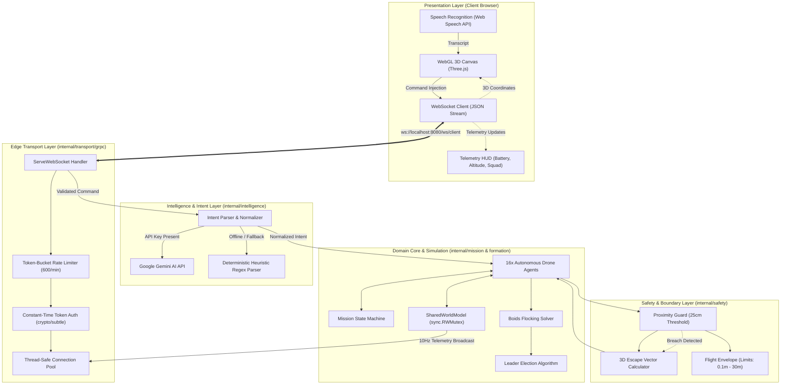
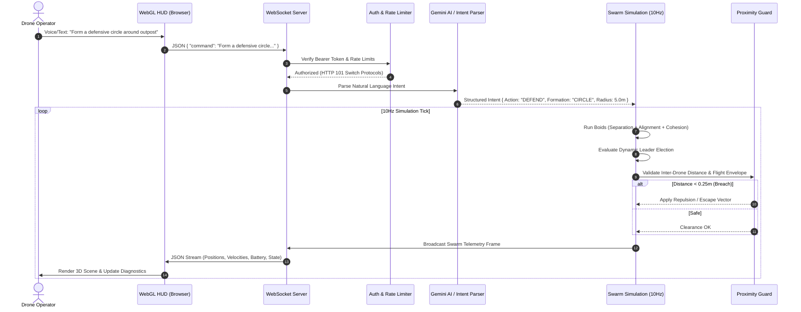

# 🚁 AI Drone Swarm Commander (Go Core)


**AI Drone Swarm Commander** is a high-performance, real-time 3D-visualized autonomous drone swarm simulator and coordination engine powered by Google's Gemini AI. Built in Go with a strict Domain-Driven Design (DDD) architecture, it transforms natural language operator voice/text commands into coordinated multi-agent spatial maneuvers, flocking dynamics (Boids), dynamic Raft-inspired leader elections, and zero-collision safety envelopes.

> 🎮 **Zero Hardware Required**: Runs 100% out-of-the-box as a standalone, physics-based 3D multi-agent simulation with an interactive WebGL HUD. No physical drones, flight controllers, or radio hardware needed—simply run the server and open your browser!

---

## 📑 Table of Contents
- [✨ Key Features](#-key-features)
- [🏛️ System Architecture](#️-system-architecture)
- [🚦 Application & Data Flow](#-application--data-flow)
- [📦 Domain-Driven Layer Structure](#-domain-driven-layer-structure)
- [🛡️ Security Architecture & Practices](#️-security-architecture--practices)
- [🚀 Quick Start & Installation](#-quick-start--installation)
- [🐳 Docker & Containerization](#-docker--containerization)
- [📡 API & WebSocket Protocol](#-api--websocket-protocol)
- [🧪 Testing & Quality Assurance](#-testing--quality-assurance)
- [🤝 Contributing](#-contributing)
- [📜 License](#-license)

---

## ✨ Key Features

* 🧠 **Gemini Multimodal Intent Engine**: Translates natural language ("*Form a defensive perimeter around the vehicle*") into 3D geometric target coordinates and mission states.
* 🐦 **Boids Swarm Intelligence**: Distributed Reynolds Flocking algorithms calculating Cohesion, Alignment, and Separation vectors in real time.
* 👑 **Dynamic Leader Election**: Autonomous leader scoring based on battery life, altitude stability, and centroid proximity.
* 🛡️ **Autonomous Safety & Proximity Guard**: Dynamic proximity thresholding (25cm to 1.5m) with automatic 3D escape vector calculation and collision avoidance.
* 🕹️ **Real-Time WebGL HUD**: Low-latency Three.js 3D dashboard with live telemetry streaming, battery monitoring, and interactive orbit controls.
* 🔒 **Hardened Transport Security**: WebSocket authentication using constant-time comparison (`crypto/subtle`), in-memory token-bucket rate limiting (600 req/min), and strict Content Security Policies (CSP).

---

## 🏛️ System Architecture

The core engine follows strict **Domain-Driven Design (DDD)** boundaries to isolate spatial mathematics, safety protocols, and external AI integrations.



---

## 🚦 Application & Data Flow



---

## 📦 Domain-Driven Layer Structure

```
swarm-core-go/
├── cmd/
│   └── swarm-server/         # Main entry point & service bootstrapper
├── internal/
│   ├── core/                 # Shared domain types, flight envelope, configuration
│   ├── formation/            # Boids solver, dynamic leader election, grid allocators
│   ├── intelligence/         # Gemini AI client & deterministic fallback parser
│   ├── mission/              # Agent decision loops, physics integration, FSM
│   ├── safety/               # Collision avoidance, proximity guard, escape vectors
│   ├── telemetry/            # Diagnostic logging and event streams
│   └── transport/grpc/       # WebSocket handlers, rate limiters, auth middleware
├── web/
│   └── hud.html              # Modern WebGL Three.js real-time 3D dashboard
├── .env.example              # Template environment variables
├── Dockerfile                # Multi-stage production container build
├── docker-compose.yml        # Multi-container orchestration
└── go.mod                    # Go module dependencies
```

---

## 🛡️ Security Architecture & Practices

| Security Domain | Mitigation / Implementation |
|---|---|
| **Timing Attacks** | Token validation utilizes `crypto/subtle.ConstantTimeCompare` to eliminate side-channel timing leaks. |
| **Denial of Service** | In-memory token-bucket rate limiter enforces strict request caps (600 req/min per IP). |
| **XSS & Clickjacking** | Strict security headers configured on HUD endpoints: `X-Frame-Options: DENY`, `X-Content-Type-Options: nosniff`, and whitelisted `Content-Security-Policy (CSP)`. |
| **Fail-Safe Defaults** | Automatic fallback to deterministic regex NLP when API keys are absent or rate-limited; autonomous return-to-base on low battery (<20%). |
| **Memory Safety** | Zero memory race conditions; all shared world mutations are strictly gated behind `sync.RWMutex`. |

---

## 🚀 Quick Start & Installation

### Prerequisites
* **Go**: `1.22+`
* **Google Gemini API Key**: (Optional, regex fallback included)

### 1. Clone & Setup
```bash
git clone https://github.com/Sh1vaay/drone-copilot.git
cd drone-copilot/swarm-core-go
```

### 2. Configure Environment
```bash
cp .env.example .env
# Edit .env and supply your credentials:
# GEMINI_API_KEY=your_key_here
# WS_AUTH_TOKEN=super_secret_auth_token_123
```

### 3. Run Locally
```bash
go mod tidy
go run ./cmd/swarm-server
```

Open your browser and navigate to **[http://localhost:8080](http://localhost:8080)** to access the live 3D Swarm HUD.

---

## 🐳 Docker & Containerization

Run the standalone containerized swarm server using Docker:

```bash
# Build the multi-stage image
docker build -t drone-swarm-core:latest .

# Run container
docker run -p 8080:8080 --env-file .env drone-swarm-core:latest
```

Or using **Docker Compose**:
```bash
docker-compose up --build -d
```

---

## 📡 API & WebSocket Protocol

### WebSocket Endpoint: `/ws/client`

#### Authentication Headers
```http
GET /ws/client HTTP/1.1
Host: localhost:8080
Upgrade: websocket
Connection: Upgrade
Authorization: Bearer <WS_AUTH_TOKEN>
```

#### Client Command Payload (Inbound)
```json
{
  "command": "form a defensive perimeter around target Alpha",
  "priority": 1
}
```

#### Telemetry Broadcast Frame (Outbound, 10Hz)
```json
{
  "step": 1420,
  "intent": { "action": "DEFEND", "target": "Vehicle-Alpha" },
  "active_drones": 16,
  "drones": [
    {
      "id": "drone-sim-A",
      "squad": "SQUAD-0-0-0",
      "role": "LEADER",
      "position": { "x": 3.42, "y": -1.21, "z": 4.50 },
      "velocity": { "x": 0.12, "y": -0.05, "z": 0.00 },
      "battery": 88,
      "state": "FORMATION"
    }
  ]
}
```

---

## 🧪 Testing & Quality Assurance

Run the comprehensive unit and integration test suite:

```bash
# Run all unit and integration tests
go test -v -race ./...

# Run test coverage analysis
go test -coverprofile=coverage.out ./...
go tool cover -func=coverage.out
```

---

## 🤝 Contributing

We welcome contributions! Please adhere to the following workflow:
1. **Fork the Repository**
2. **Create a Feature Branch** (`git checkout -b feature/swarm-optimization`)
3. **Commit Changes** (`git commit -m 'feat: add obstacle avoidance vector'`)
4. **Push Branch** (`git push origin feature/swarm-optimization`)
5. **Open a Pull Request**

---

## 📜 License

This project is licensed under the **Apache License, Version 2.0**. See the [LICENSE](LICENSE) file for complete details.
